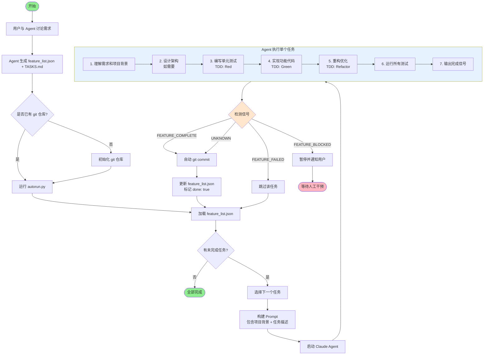

# Agent Harness - 长期任务自动化框架

基于 [Anthropic: Effective harnesses for long-running agents](https://www.anthropic.com/engineering/effective-harnesses-for-long-running-agents) 实现。

## 概述

这个 harness 让你能够用 Claude 自动化执行大型长期任务，通过以下方式：

- **增量进度**: 每次只实现一个功能，确保代码始终可运行
- **TDD 驱动**: 强制测试驱动开发，保证代码质量
- **自动化循环**: autorun.py 自动执行所有任务直到完成
- **智能信号**: 支持 COMPLETE/BLOCKED/FAILED 三种状态
- **架构规范**: 遵循模块化、可测试性等设计原则

---

## 快速开始

### 步骤 1: 与 Agent 讨论需求并生成任务清单

使用 `skill/SKILL.md` 技能与 Claude 讨论你的项目需求：

```bash
cd ~/work/your-project
claude --add-skill /path/to/harness/skill/SKILL.md
```

告诉 Claude 你的项目需求，例如：
> "帮我创建一个实时录音转录应用，使用 Flutter + Riverpod"

Agent 会与你深入讨论并生成：
- `feature_list.json` - 包含项目背景和详细任务列表
- `TASKS.md` - 包含 Mermaid 架构图和任务详细描述

### 步骤 2: 自动执行所有任务

```bash
# 前台运行（实时查看输出）
python3 /path/to/harness/autorun.py .

# 后台运行
/path/to/harness/run-bg.sh .
```

自动运行流程：
1. 读取下一个未完成的功能
2. 启动 Claude agent 实现功能
3. Agent 编写测试、实现代码、运行测试
4. 检测完成信号（COMPLETE/BLOCKED/FAILED）
5. 自动 git commit
6. 更新 feature_list.json
7. 重复直到全部完成

按 `Ctrl+C` 可随时停止。

---

## 核心文件说明

| 文件 | 用途 |
|------|------|
| `feature_list.json` | 项目背景 + 所有功能点列表（ID、标题、描述、优先级、依赖、测试要求） |
| `TASKS.md` | 任务详细描述 + Mermaid 架构图（可选，由 Agent 生成） |
| `autorun.py` | 自动循环执行脚本 |
| `harness_system_prompt.md` | Agent 核心工作规范（架构、测试、TDD 要求） |

---

## 完整工作流程



### 关键环节说明

1. **需求讨论阶段**
   - 使用 `skill/SKILL.md` 与 Agent 深入讨论
   - Agent 会询问技术栈、架构设计、测试要求等
   - 生成结构化的 `feature_list.json` 和可视化的 `TASKS.md`

2. **自动执行阶段**
   - `autorun.py` 循环读取未完成任务
   - 动态构建包含项目背景的 prompt
   - 启动独立的 Claude agent 进程执行单个任务

3. **Agent 工作流程**
   - 严格遵循 TDD（测试驱动开发）
   - 先写测试，再写实现，最后重构
   - 确保代码符合架构设计原则

4. **信号检测与处理**
   - `FEATURE_COMPLETE`: 自动提交并继续
   - `FEATURE_BLOCKED`: 需要人工解决依赖或配置问题
   - `FEATURE_FAILED`: 遇到无法解决的错误，跳过继续
   - `UNKNOWN`: 未检测到信号，假设成功（向后兼容）

---

## 开发规范

### 架构设计原则
- **模块化**: 功能模块独立，低耦合高内聚
- **可测试性**: 每个模块都应该易于单元测试
- **单一职责**: 每个类/函数只做一件事
- **依赖注入**: 便于测试和替换实现

### 测试要求
- **必须编写单元测试**: 除非明确标记 `tests_required: false`
- **TDD 优先**: 推荐测试驱动开发（先写测试，再写实现）
- **测试覆盖核心逻辑**: 至少覆盖主要业务逻辑和边界情况
- **测试必须通过**: 每次完成后确保所有测试通过

### Git Commit 规范
- 使用语义化提交信息（Conventional Commits）
- 格式: `<type>: <description>`
- 常用 type: `feat`, `fix`, `refactor`, `test`, `docs`, `chore`
- 示例: `feat: add user authentication module`

---

## 使用技巧

1. **详细讨论需求**: 与 Agent 充分讨论技术栈、架构设计、测试策略
2. **合理拆分任务**: 功能拆得越细、越独立，越容易实现和测试
3. **明确依赖关系**: 在 `feature_list.json` 中正确设置任务依赖
4. **检查进度**: 用 `git log --oneline` 查看已完成的功能
5. **处理阻塞**: 遇到 BLOCKED 信号时，解决问题后重新运行 autorun.py
6. **技能集成**: 可指定 `vibe-coding-master` 等技能获得更专业的代码规范

---

## 文件结构

```
harness/
├── autorun.py                  # 自动循环执行脚本
├── run-bg.sh                   # 后台运行辅助脚本
├── harness_system_prompt.md    # Agent 核心工作规范
├── skill/
│   └── SKILL.md               # Agent 技能定义
├── feature_list.sample.json   # JSON 格式示例
└── README.md

your-project/
├── feature_list.json          # 项目背景 + 任务列表
├── TASKS.md                   # 任务详细描述 + Mermaid 图（可选）
├── .git/                      # Git 仓库
└── src/                       # 你的代码
```

---

## 运行示例

```bash
# 1. 创建项目目录
mkdir ~/work/transcriber
cd ~/work/transcriber

# 2. 与 Agent 讨论需求
claude --add-skill /path/to/harness/skill/SKILL.md
# 告诉 Agent: "帮我创建一个实时录音转录应用，使用 Flutter + Riverpod"

# 3. Agent 会生成 feature_list.json 和 TASKS.md

# 4. 初始化 git（如果还没有）
git init
git add .
git commit -m "chore: initial project setup"

# 5. 开始自动运行
python3 /path/to/harness/autorun.py .

# 6. 查看进度
git log --oneline
cat feature_list.json
```

---

## 常见问题

### Q: 如何处理 BLOCKED 信号？
A: 查看 Agent 输出的阻塞原因，解决后重新运行 `autorun.py`。

### Q: 可以中途修改任务列表吗？
A: 可以手动编辑 `feature_list.json`，但要保持 JSON 格式正确。

### Q: 如何跳过某个失败的任务？
A: 手动将该任务的 `done` 设为 `true`，或删除该任务。

### Q: 支持哪些技能？
A: 在 `project_context.skill` 中可指定如 `vibe-coding-master` 等技能。

---

## 参考资料

- [Anthropic: Effective harnesses for long-running agents](https://www.anthropic.com/engineering/effective-harnesses-for-long-running-agents)
- [Conventional Commits](https://www.conventionalcommits.org/)
- [Test-Driven Development (TDD)](https://en.wikipedia.org/wiki/Test-driven_development)
