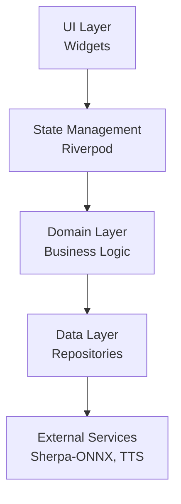
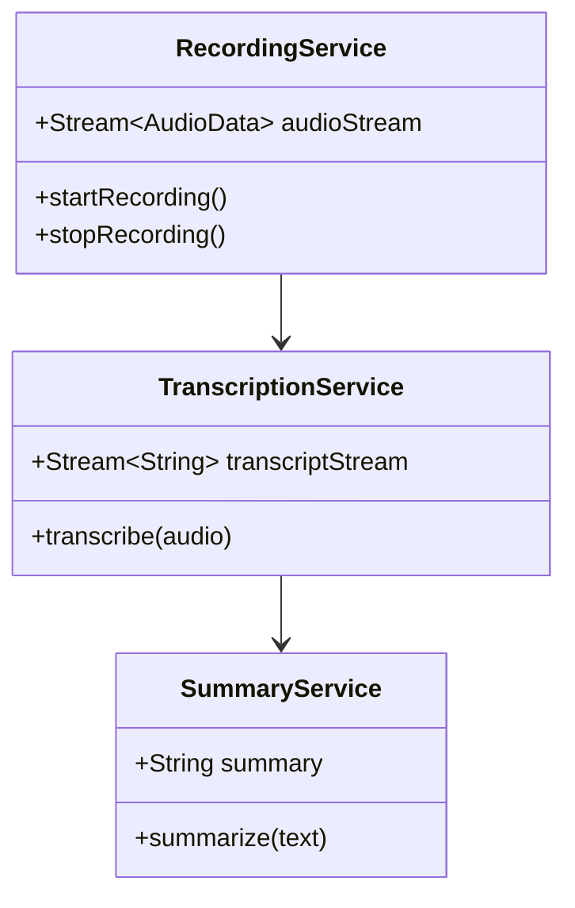
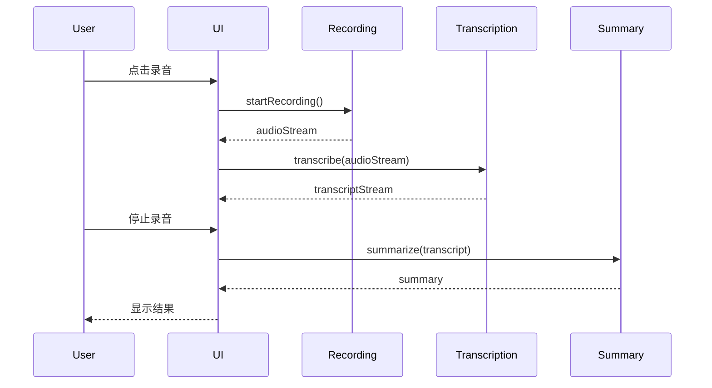

# Agent Harness

用于使用 Claude Code 运行长时间任务的工作流。

## 概述

这个 skill 将大型任务拆分为多个小功能点，逐个实现，每次完成后自动提交并记录进度。

---

## 场景 1: 从 0 开始新项目

告诉我你的项目需求，例如：

> "帮我创建一个可以读取文本故事并生成有声漫画的程序"

我将帮你：
1. 深入讨论需求，明确技术栈和架构设计
2. 拆分成具体、可测试的功能点
3. 创建 **feature_list.json**（包含项目背景、架构原理规则和任务列表）
4. 创建 **TASKS.md**（包含 Mermaid 架构图、数据模型、核心流程和任务详细描述）
5. 初始化 git 仓库（如果需要）

**我会确保：**
- 每个任务都是独立、可测试的
- 任务之间的依赖关系清晰
- 架构设计符合最佳实践，并用 Mermaid 图可视化
- 明确哪些任务需要单元测试
- TASKS.md 包含完整的架构设计、实体关系、流程图等

---

## 场景 2: 已有项目执行长期任务

如果你有一个已有项目，想用特定 skill 执行任务：

### 步骤 1: 创建 feature_list.json 和 TASKS.md

让我帮你创建包含项目背景和任务列表的 `feature_list.json`，以及包含架构设计的 `TASKS.md`：

#### feature_list.json

```json
{
  "project_context": {
    "name": "项目名称",
    "description": "项目简介",
    "tech_stack": "技术栈",
    "architecture": "架构设计",
    "development_approach": "开发方法（如 TDD）",
    "code_standards": [
      "代码规范1",
      "代码规范2"
    ],
    "skill": "skill-name"  // 可选：指定使用的 skill
  },
  "features": [
    {
      "id": 1,
      "title": "任务名称",
      "description": "详细描述这个任务要做什么",
      "priority": "high",
      "dependencies": [],
      "done": false,
      "tests_required": true
    }
  ]
}
```

#### TASKS.md

包含以下内容：
- **项目概述**：项目背景、目标、技术栈
- **架构设计**：使用 Mermaid 类图、组件图展示系统架构
- **数据模型**：使用 Mermaid ER 图展示实体关系
- **核心流程**：使用 Mermaid 流程图展示关键业务流程
- **任务详细描述**：每个任务的详细实现说明、验收标准

---

## 核心文件格式

### feature_list.json

这是唯一需要的配置文件，包含项目背景和任务列表：

```json
{
  "project_context": {
    "name": "项目名称",
    "description": "项目简介",
    "tech_stack": "技术栈（如 Flutter/Dart + Riverpod）",
    "architecture": "架构设计（如 Feature-First + Clean Architecture）",
    "development_approach": "开发方法（如 TDD）",
    "code_standards": [
      "代码规范1",
      "代码规范2"
    ],
    "skill": "可选：指定使用的 skill"
  },
  "features": [
    {
      "id": 1,
      "title": "功能标题",
      "description": "详细描述这个功能要做什么",
      "priority": "high|medium|low",
      "dependencies": [依赖的功能 ID],
      "done": false,
      "tests_required": true
    }
  ]
}
```

**说明：**
- `project_context`: 项目背景信息，会自动注入到每个子任务的 prompt 中
  - `skill`: 可指定使用的技能（如 `vibe-coding-master`），Agent 会遵循该技能的所有规范
- `features`: 任务列表，按优先级和依赖关系执行
  - `tests_required`: 是否需要单元测试（默认 true）
- `done`: 任务完成状态，由 autorun.py 自动更新

### TASKS.md 格式示例

```markdown
# 项目任务详细说明

## 项目概述

**项目名称**: Fonnx Transcriber  
**技术栈**: Flutter/Dart + Riverpod + GoRouter + Freezed  
**架构**: Feature-First 分层架构 + Clean Architecture  
**开发方法**: TDD (Test-Driven Development)

## 系统架构

### 整体架构



### 核心模块



### 数据流程



## 任务详细说明

### Task 1: 项目架构重构

**目标**: 按照 Feature-First 分层架构重构项目  
**验收标准**:
- [ ] 创建 `lib/core/` 目录存放共享代码
- [ ] 创建 `lib/features/` 目录按功能组织代码
- [ ] 每个 feature 包含 `data/`, `domain/`, `presentation/` 子目录
- [ ] 所有模块可独立测试

**实现要点**:
- 使用 Riverpod 进行依赖注入
- 遵循 Clean Architecture 原则
- 确保模块间低耦合

### Task 2: 录音模块实现

**目标**: 实现实时麦克风音频采集  
**验收标准**:
- [ ] 使用 `record` 包采集音频流
- [ ] 支持开始、暂停、停止操作
- [ ] 提供音频流 Stream<List<int>>
- [ ] 编写单元测试覆盖核心逻辑

...
```

---

## 开发规范

### 架构设计原则
- **模块化**: 功能模块独立，低耦合高内聚
- **可测试性**: 每个模块都应该易于单元测试
- **清晰的职责**: 每个类/函数只做一件事（单一职责原则）
- **依赖注入**: 便于测试和替换实现

### 测试要求
- **必须编写单元测试**: 除非功能明确标记为 `tests_required: false`
- **TDD 优先**: 推荐采用测试驱动开发（先写测试，再写实现）
- **测试覆盖核心逻辑**: 至少覆盖主要业务逻辑和边界情况
- **测试必须通过**: 每次完成后确保所有测试通过

### Git Commit 规范
- 使用语义化提交信息（Conventional Commits）
- 格式: `<type>: <description>`
- 常用 type: `feat`, `fix`, `refactor`, `test`, `docs`, `chore`
- 示例: `feat: add user authentication module`
- **注意**: commit 由 autorun.py 自动执行，Agent 只需确保代码质量

---

## Agent 完成信号

Agent 完成每个任务后，会输出以下信号之一：
- `FEATURE_COMPLETE` - 功能已完成（测试通过，代码可运行）
- `FEATURE_BLOCKED` - 需要人工干预才能继续
- `FEATURE_FAILED` - 遇到无法解决的错误

**注意：** Agent 不需要关注整体项目是否完成，只需专注当前功能。

## 工作流程

### Agent 执行流程（每个任务）
1. **理解需求**: 阅读任务描述和项目背景
2. **设计架构**: 如果是新功能，先设计模块结构
3. **编写测试**: 先写单元测试（TDD: Red）
4. **实现功能**: 编写刚好能通过测试的代码（TDD: Green）
5. **重构优化**: 在测试保护下优化代码（TDD: Refactor）
6. **运行测试**: 确保所有测试通过
7. **输出信号**: 输出 FEATURE_COMPLETE/BLOCKED/FAILED

### autorun.py 自动处理
- 检测 Agent 输出的完成信号
- 自动执行 `git add -A` 和 `git commit`
- 更新 `feature_list.json` 标记任务完成
- 继续执行下一个任务，直到全部完成

## 重要说明

- 需要在新终端运行 autorun.py（不能在 Claude Code 窗口内运行）
- 脚本会自动 commit 和更新 feature_list.json
- 所有任务完成后自动停止
- 项目背景信息会自动注入到每个子任务的 prompt 中
- 不需要手动创建 CLAUDE.md 或 claude-progress.txt
- Agent 必须遵循 TDD 流程和架构设计原则

---

---

## 输出文件要求

当与用户讨论完需求后，你必须生成以下两个文件：

### 1. feature_list.json
- 包含完整的 `project_context` 和 `features` 列表
- 确保 JSON 格式正确，可以被 `autorun.py` 解析
- 每个任务都有明确的 `id`, `title`, `description`, `priority`, `dependencies`, `tests_required`

### 2. TASKS.md
- 包含项目概述、技术栈、架构设计
- **必须包含 Mermaid 图**：
  - 系统架构图（组件图或分层图）
  - 核心模块类图
  - 关键业务流程的序列图或流程图
  - 数据模型 ER 图（如适用）
- 每个任务的详细说明、验收标准、实现要点
- 使用 Markdown 格式，清晰易读

---

现在，告诉我你的项目需求是什么？
